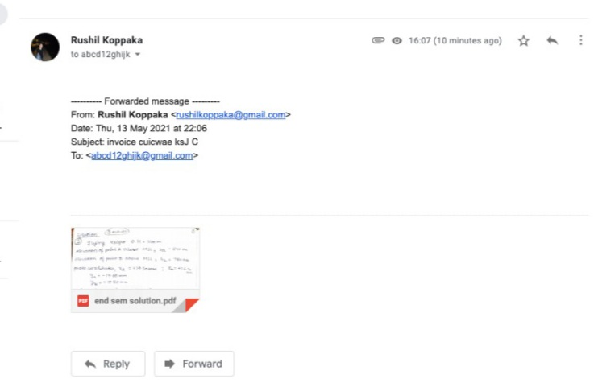
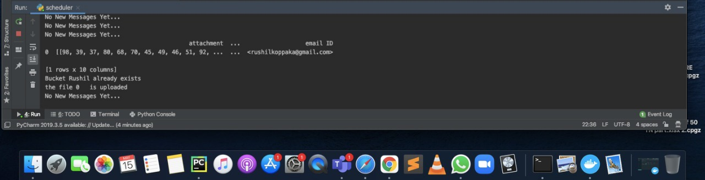
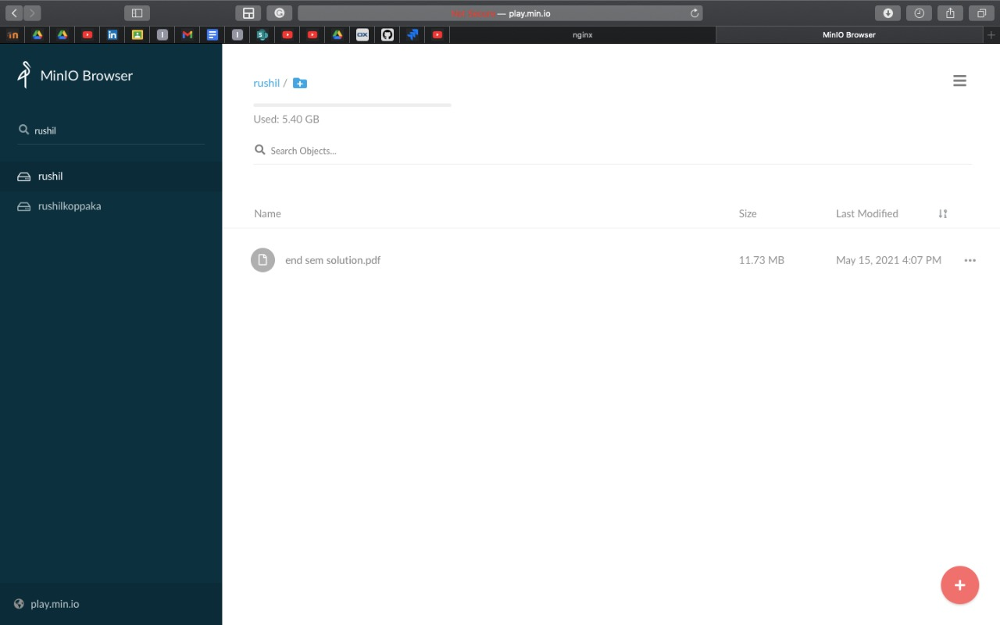

# Assignment-1

# TODO's:
 
  1. Read a email and check for attachments to process the data for extracting insights from the mail serveR
  2. Analyse and create a storage container in minio for storing the documents read from email server. Only for streaming inserts

## TASK 1:

   * We have  made a scheduler which constanty check our email for any mail subject **invoice**.
   
   * Once it figure out it is invoice mail it extract all the information from the mail.
   
   * It store the data in form of **dataframe** you can store it any form as you like to.
   
  
## TASK 2:
   
   * We have to store the data to minio and there is a format in which we store data into it.
   * The minio has concept of buckets and objects.
   * It has an access key and secret key to login to our object storage.
  
   
   * **Suppose** there are 10 mail with of different companies now we cannot store all the invoice in one bucket 
   * It will be hard to retierve data and find its owner.We resolve it using this analogy.
   * Username = **Bucket name**
   * File name = **Object name**

   ### Private server
   
   * Above all data was on public server where people have uploaded the data for learning minio
   * we can setup our own server for object storage.
   * for simple and secure step up, we have change the access key and secret key, so that no one can access out data.
    
